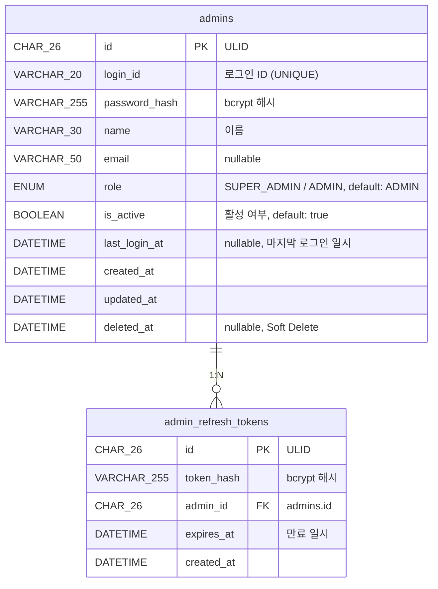

# 관리자 관련 테이블 명세

> **작성일**: 2026-03-13
> **스키마 파일**: `prisma/schema.prisma`

---

## ER 다이어그램



---

## 1. `admins` — 관리자

시스템 관리자 계정을 저장한다. `role`로 권한을 구분하며, ID/PW 기반 로그인을 사용한다.

| 컬럼            | 타입            | 제약조건         | 기본값 | 설명                                |
| --------------- | --------------- | ---------------- | ------ | ----------------------------------- |
| `id`            | CHAR(26)        | **PK**           | —      | ULID                                |
| `login_id`      | VARCHAR(20)     | NOT NULL, UNIQUE | —      | 로그인 ID                           |
| `password_hash` | VARCHAR(255)    | NOT NULL         | —      | 비밀번호 bcrypt 해시 (평문 미저장)  |
| `name`          | VARCHAR(30)     | NOT NULL         | —      | 관리자 이름                         |
| `email`         | VARCHAR(50)     | nullable         | NULL   | 이메일                              |
| `role`          | ENUM(AdminRole) | NOT NULL         | ADMIN  | 권한 (SUPER_ADMIN / ADMIN)          |
| `is_active`     | BOOLEAN         | NOT NULL         | true   | 활성 여부 (비활성 시 로그인 불가)   |
| `last_login_at` | DATETIME        | nullable         | NULL   | 마지막 로그인 일시                  |
| `created_at`    | DATETIME        | NOT NULL         | now()  | 생성일                              |
| `updated_at`    | DATETIME        | NOT NULL         | auto   | 수정일 (자동 갱신)                  |
| `deleted_at`    | DATETIME        | nullable         | NULL   | 삭제일 (Soft Delete, NULL = 미삭제) |

**인덱스**

| 이름          | 컬럼       | 타입   | 설명                |
| ------------- | ---------- | ------ | ------------------- |
| `PRIMARY`     | `id`       | PK     |                     |
| `uk_login_id` | `login_id` | UNIQUE | 로그인 ID 중복 방지 |

**관계**

| 대상 테이블            | 관계 | 설명                    |
| ---------------------- | ---- | ----------------------- |
| `admin_refresh_tokens` | 1:N  | 멀티 디바이스 세션 지원 |

---

## 2. `admin_refresh_tokens` — 관리자 리프레시 토큰

관리자의 리프레시 토큰을 저장한다. 사용자(`refresh_tokens`)와 동일한 구조로 관리한다.

| 컬럼         | 타입         | 제약조건             | 기본값 | 설명                                    |
| ------------ | ------------ | -------------------- | ------ | --------------------------------------- |
| `id`         | CHAR(26)     | **PK**               | —      | ULID                                    |
| `token_hash` | VARCHAR(255) | NOT NULL             | —      | 리프레시 토큰 bcrypt 해시 (평문 미저장) |
| `admin_id`   | CHAR(26)     | **FK** → `admins.id` | —      | 토큰 소유자                             |
| `expires_at` | DATETIME     | NOT NULL             | —      | 만료 일시                               |
| `created_at` | DATETIME     | NOT NULL             | now()  | 발급일                                  |

**인덱스**

| 이름             | 컬럼         | 타입                     |
| ---------------- | ------------ | ------------------------ |
| `PRIMARY`        | `id`         | PK                       |
| `idx_admin_id`   | `admin_id`   | INDEX                    |
| `idx_expires_at` | `expires_at` | INDEX (만료 토큰 정리용) |

**FK 제약**

| 이름                            | 참조        | 설명        |
| ------------------------------- | ----------- | ----------- |
| `fk_admin_refresh_tokens_admin` | `admins.id` | 관리자 참조 |

**토큰 관리 정책**

| 항목           | 정책                                             |
| -------------- | ------------------------------------------------ |
| 저장 방식      | bcrypt 해시 (평문 미저장)                        |
| Token Rotation | 갱신 시 기존 토큰 DELETE → 새 토큰 INSERT        |
| 만료 토큰 정리 | 크론잡으로 `expires_at < now()` 레코드 주기 삭제 |
| 멀티 디바이스  | 1:N 관계로 복수 세션 허용                        |

---

## 3. Enum 정의

### `AdminRole` — 관리자 권한

| 값            | 설명                                           |
| ------------- | ---------------------------------------------- |
| `SUPER_ADMIN` | 최고 관리자 (부서/직위 관리 등 전체 권한)      |
| `ADMIN`       | 일반 관리자 (콘텐츠 관리 등 일반 권한, 기본값) |

---

## Prisma 스키마

```prisma
enum AdminRole {
  SUPER_ADMIN
  ADMIN
}

model Admin {
  id           String    @id @db.Char(26)
  loginId      String    @unique(map: "uk_login_id") @map("login_id") @db.VarChar(20)
  passwordHash String    @map("password_hash") @db.VarChar(255)
  name         String    @db.VarChar(30)
  email        String?   @db.VarChar(50)
  role         AdminRole @default(ADMIN)
  isActive     Boolean   @default(true) @map("is_active")
  lastLoginAt  DateTime? @map("last_login_at") @db.DateTime(0)
  createdAt    DateTime  @default(now()) @map("created_at") @db.DateTime(0)
  updatedAt    DateTime  @updatedAt @map("updated_at") @db.DateTime(0)
  deletedAt    DateTime? @map("deleted_at") @db.DateTime(0)

  refreshTokens AdminRefreshToken[]

  @@map("admins")
}

/// AdminRefreshToken (관리자 리프레시 토큰)
model AdminRefreshToken {
  id        String   @id @db.Char(26)
  tokenHash String   @map("token_hash") @db.VarChar(255)
  adminId   String   @map("admin_id") @db.Char(26)
  expiresAt DateTime @map("expires_at") @db.DateTime(0)
  createdAt DateTime @default(now()) @map("created_at") @db.DateTime(0)

  admin Admin @relation(fields: [adminId], references: [id], map: "fk_admin_refresh_tokens_admin")

  @@index([adminId], map: "idx_admin_id")
  @@index([expiresAt], map: "idx_expires_at")
  @@map("admin_refresh_tokens")
}
```
