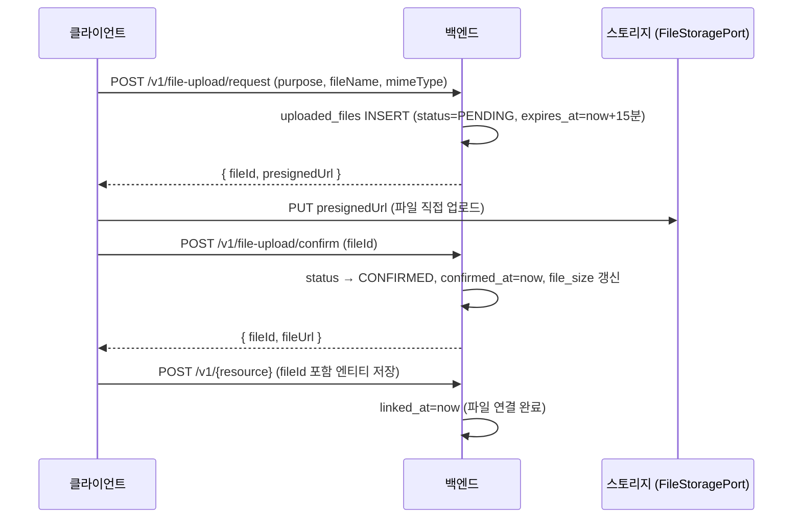
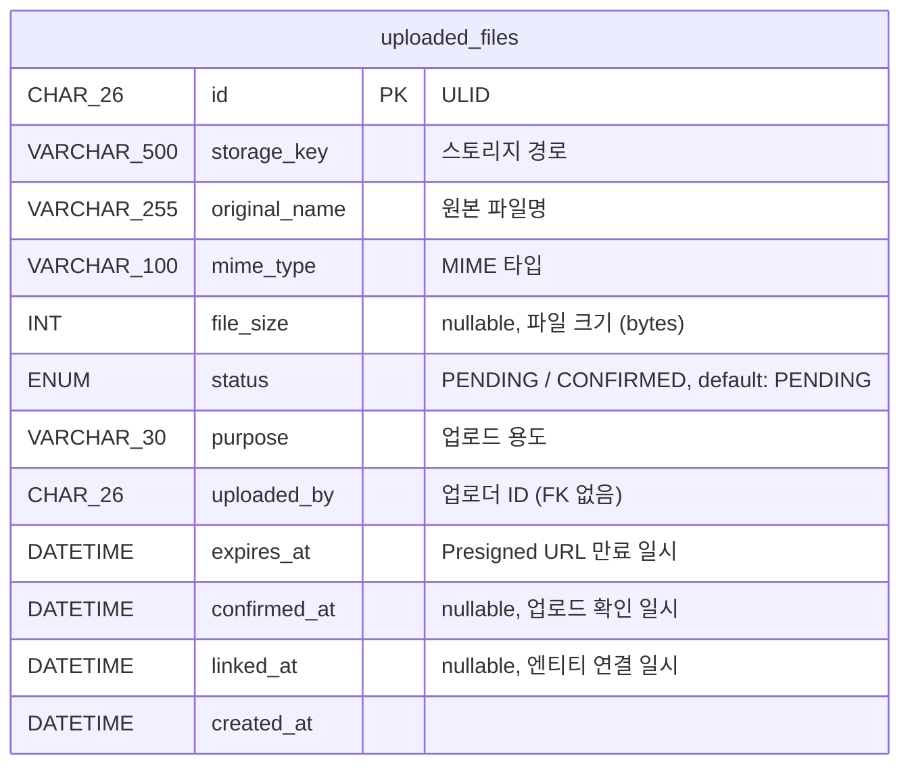

# 파일 업로드 관련 테이블 명세

> **작성일**: 2026-03-13
> **스키마 파일**: `prisma/schema.prisma`

---

## 설계 배경

클라이언트가 스토리지에 직접 업로드(Presigned URL 방식)하는 흐름에서, 업로드 상태를 추적하고 미연결 파일(고아 파일)을 주기적으로 정리하기 위한 테이블이다.

스토리지 구현은 `FileStoragePort` 추상 인터페이스로 분리되어 있어 스토리지 벤더에 종속되지 않는다. 현재는 개발 환경용 `MockFileStorageAdapter`(로컬 파일시스템)만 구현되어 있으며, 프로덕션 어댑터(Firebase Storage 등)는 별도 구현 예정이다.

### 업로드 흐름



### 파일 생명주기 및 정리 정책

| 단계               | 상태 변화        | 정리 조건                                          | 정리 방식                        |
| ------------------ | ---------------- | -------------------------------------------------- | -------------------------------- |
| Presigned URL 발급 | `PENDING`        | `expires_at < now` (15분 초과)                     | DB + 스토리지 삭제               |
| 업로드 확인 완료   | `CONFIRMED`      | `confirmed_at < now - 24h` AND `linked_at IS NULL` | DB + 스토리지 삭제               |
| 엔티티 연결 완료   | `linked_at` 기록 | `linked_at < now - 7일`                            | DB 레코드만 삭제 (스토리지 유지) |

고아 파일 정리 크론: **매일 오전 2시** (`0 2 * * *`, Asia/Seoul)

---

## ER 다이어그램



---

## 1. `uploaded_files` — 업로드 파일

Presigned URL을 통해 Firebase Storage에 업로드된 파일의 상태를 추적한다. 다른 엔티티 테이블과 직접 FK 연결 없이, `fileId`를 통해 애플리케이션 레이어에서 연결을 처리한다.

| 컬럼            | 타입             | 제약조건 | 기본값  | 설명                                                     |
| --------------- | ---------------- | -------- | ------- | -------------------------------------------------------- |
| `id`            | CHAR(26)         | **PK**   | —       | ULID                                                     |
| `storage_key`   | VARCHAR(500)     | NOT NULL | —       | 스토리지 파일 경로 (`{purpose}/{YYYY-MM}/{ULID}.{ext}`)  |
| `original_name` | VARCHAR(255)     | NOT NULL | —       | 원본 파일명                                              |
| `mime_type`     | VARCHAR(100)     | NOT NULL | —       | MIME 타입                                                |
| `file_size`     | INT              | nullable | NULL    | 파일 크기 (bytes) — `confirm` 시점에 실제 크기로 갱신    |
| `status`        | ENUM(FileStatus) | NOT NULL | PENDING | 업로드 상태                                              |
| `purpose`       | VARCHAR(30)      | NOT NULL | —       | 업로드 용도 (허용 값 목록은 아래 참조)                   |
| `uploaded_by`   | CHAR(26)         | NOT NULL | —       | 업로더 ULID (관리자 또는 사용자, FK 제약 없음)           |
| `expires_at`    | DATETIME         | NOT NULL | —       | Presigned URL 만료 일시 (생성 시각 + 15분)               |
| `confirmed_at`  | DATETIME         | nullable | NULL    | 업로드 확인 완료 일시 (`confirm` API 호출 시 기록)       |
| `linked_at`     | DATETIME         | nullable | NULL    | 엔티티 연결 완료 일시 (게시글 저장 등 최종 사용 시 기록) |
| `created_at`    | DATETIME         | NOT NULL | now()   | 레코드 생성일 (Presigned URL 발급 일시)                  |

**인덱스**

| 이름                                    | 컬럼                                    | 타입  | 설명                                              |
| --------------------------------------- | --------------------------------------- | ----- | ------------------------------------------------- |
| `PRIMARY`                               | `id`                                    | PK    |                                                   |
| `idx_uploaded_files_status_expires`     | `status` + `expires_at`                 | INDEX | 만료된 PENDING 파일 조회 (고아 파일 정리 1단계)   |
| `idx_uploaded_files_confirmed_unlinked` | `status` + `linked_at` + `confirmed_at` | INDEX | 미연결 CONFIRMED 파일 조회 (고아 파일 정리 2단계) |

**비고**

- `uploaded_by`는 관리자 또는 사용자 ULID 모두 가능하므로 FK 제약 없음
- `storage_key`는 `{purpose}/{YYYY-MM}/{ULID}.{ext}` 형식으로 자동 생성
- 연결 완료(`linked_at` 기록) 후 7일이 지나면 DB 레코드만 삭제 (스토리지 파일은 실제 엔티티가 사용 중이므로 유지)

---

## 2. Enum 정의

### `FileStatus` — 업로드 상태

| 값          | 설명                                       |
| ----------- | ------------------------------------------ |
| `PENDING`   | Presigned URL 발급됨, 스토리지 업로드 대기 |
| `CONFIRMED` | 스토리지 업로드 확인 완료                  |

---

## 3. 용도별 업로드 정책 (`purpose`)

`purpose` 컬럼은 허용 MIME 타입과 최대 파일 크기를 결정하는 업로드 정책을 식별한다.

| `purpose` 값     | 사용 위치            | 허용 MIME 타입                        | 최대 크기 |
| ---------------- | -------------------- | ------------------------------------- | --------- |
| `profile-image`  | 프로필 이미지        | jpeg, png, webp                       | 5 MB      |
| `attachment`     | 일반 첨부            | jpeg, png, gif, webp, pdf, xlsx, docx | 20 MB     |
| `editor-content` | 에디터 인라인 이미지 | jpeg, png, gif, webp                  | 5 MB      |

---

## Prisma 스키마

```prisma
enum FileStatus {
  PENDING   // Presigned URL 발급됨, 업로드 대기
  CONFIRMED // 업로드 확인 완료
}

/// UploadedFile (업로드 파일)
model UploadedFile {
  id           String     @id @db.Char(26)
  storageKey   String     @map("storage_key") @db.VarChar(500)
  originalName String     @map("original_name") @db.VarChar(255)
  mimeType     String     @map("mime_type") @db.VarChar(100)
  fileSize     Int?       @map("file_size")
  status       FileStatus @default(PENDING)
  purpose      String     @db.VarChar(30)
  uploadedBy   String     @map("uploaded_by") @db.Char(26)
  expiresAt    DateTime   @map("expires_at") @db.DateTime(0)
  confirmedAt  DateTime?  @map("confirmed_at") @db.DateTime(0)
  linkedAt     DateTime?  @map("linked_at") @db.DateTime(0)
  createdAt    DateTime   @default(now()) @map("created_at") @db.DateTime(0)

  @@index([status, expiresAt], map: "idx_uploaded_files_status_expires")
  @@index([status, linkedAt, confirmedAt], map: "idx_uploaded_files_confirmed_unlinked")
  @@map("uploaded_files")
}
```
