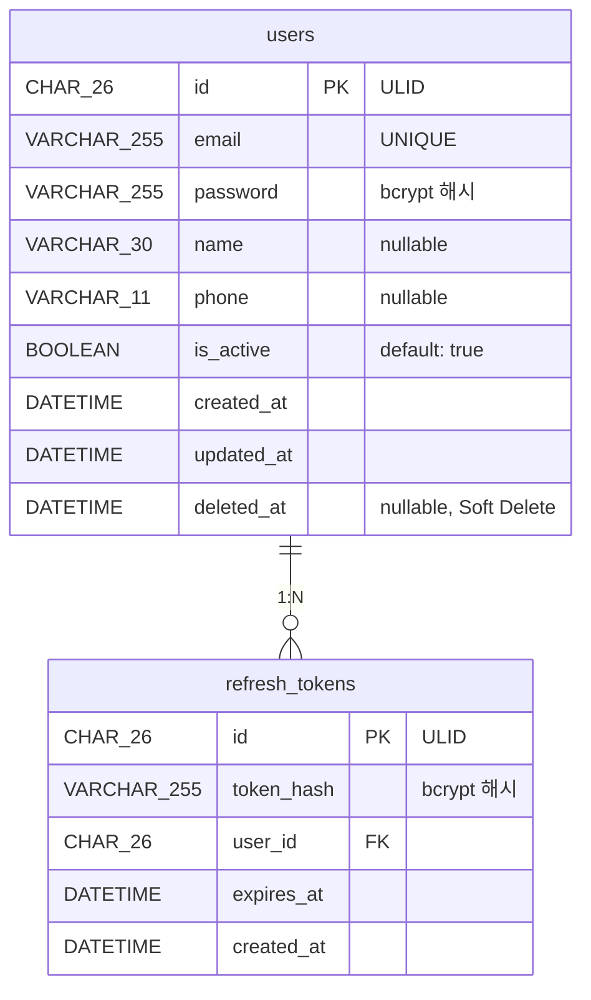

# 사용자 관련 테이블 명세

> **작성일**: 2026-04-13
> **스키마 파일**: `prisma/schema.prisma`

---

## ER 다이어그램



---

## 1. `users` — 사용자

이메일/비밀번호 기반 사용자 계정을 저장한다.

| 컬럼         | 타입         | 제약조건         | 기본값 | 설명                                |
| ------------ | ------------ | ---------------- | ------ | ----------------------------------- |
| `id`         | CHAR(26)     | **PK**           | —      | ULID                                |
| `email`      | VARCHAR(255) | NOT NULL, UNIQUE | —      | 이메일 (로그인 ID)                  |
| `password`   | VARCHAR(255) | NOT NULL         | —      | 비밀번호 bcrypt 해시 (평문 미저장)  |
| `name`       | VARCHAR(30)  | nullable         | NULL   | 이름                                |
| `phone`      | VARCHAR(11)  | nullable         | NULL   | 전화번호 (하이픈 제거)              |
| `is_active`  | BOOLEAN      | NOT NULL         | true   | 활성 여부 (비활성 시 로그인 불가)   |
| `created_at` | DATETIME     | NOT NULL         | now()  | 생성일                              |
| `updated_at` | DATETIME     | NOT NULL         | auto   | 수정일 (자동 갱신)                  |
| `deleted_at` | DATETIME     | nullable         | NULL   | 삭제일 (Soft Delete, NULL = 미삭제) |

**인덱스**

| 이름       | 컬럼    | 타입   | 설명             |
| ---------- | ------- | ------ | ---------------- |
| `PRIMARY`  | `id`    | PK     |                  |
| `uk_email` | `email` | UNIQUE | 이메일 중복 방지 |

**관계**

| 대상 테이블      | 관계 | 설명                    |
| ---------------- | ---- | ----------------------- |
| `refresh_tokens` | 1:N  | 멀티 디바이스 세션 지원 |

---

## 2. `refresh_tokens` — 리프레시 토큰

| 컬럼         | 타입         | 제약조건            | 기본값 | 설명                                    |
| ------------ | ------------ | ------------------- | ------ | --------------------------------------- |
| `id`         | CHAR(26)     | **PK**              | —      | ULID                                    |
| `token_hash` | VARCHAR(255) | NOT NULL            | —      | 리프레시 토큰 bcrypt 해시 (평문 미저장) |
| `user_id`    | CHAR(26)     | **FK** → `users.id` | —      | 토큰 소유자                             |
| `expires_at` | DATETIME     | NOT NULL            | —      | 만료 시각                               |
| `created_at` | DATETIME     | NOT NULL            | now()  | 발급일                                  |

**인덱스**

| 이름             | 컬럼         | 타입                     |
| ---------------- | ------------ | ------------------------ |
| `PRIMARY`        | `id`         | PK                       |
| `idx_user_id`    | `user_id`    | INDEX                    |
| `idx_expires_at` | `expires_at` | INDEX (만료 토큰 정리용) |

**FK 제약**

| 이름                     | 참조       | 설명        |
| ------------------------ | ---------- | ----------- |
| `fk_refresh_tokens_user` | `users.id` | 사용자 참조 |

**토큰 관리 정책**

| 항목           | 정책                                             |
| -------------- | ------------------------------------------------ |
| 저장 방식      | bcrypt 해시 (평문 미저장)                        |
| Token Rotation | 갱신 시 기존 토큰 DELETE → 새 토큰 INSERT        |
| 만료 토큰 정리 | 크론잡으로 `expires_at < now()` 레코드 주기 삭제 |
| 멀티 디바이스  | 1:N 관계로 복수 세션 허용                        |

---

## Prisma 스키마

```prisma
model User {
  id        String    @id @db.Char(26)
  email     String    @unique @db.VarChar(255)
  password  String    @db.VarChar(255)
  name      String?   @db.VarChar(30)
  phone     String?   @db.VarChar(11)
  isActive  Boolean   @default(true) @map("is_active")
  createdAt DateTime  @default(now()) @map("created_at") @db.DateTime(0)
  updatedAt DateTime  @updatedAt @map("updated_at") @db.DateTime(0)
  deletedAt DateTime? @map("deleted_at") @db.DateTime(0)

  refreshTokens RefreshToken[]

  @@map("users")
}

model RefreshToken {
  id        String   @id @db.Char(26)
  userId    String   @map("user_id") @db.Char(26)
  tokenHash String   @map("token_hash") @db.VarChar(255)
  expiresAt DateTime @map("expires_at") @db.DateTime(0)
  createdAt DateTime @default(now()) @map("created_at") @db.DateTime(0)

  user User @relation(fields: [userId], references: [id], map: "fk_refresh_tokens_user")

  @@index([userId], map: "idx_user_id")
  @@index([expiresAt], map: "idx_expires_at")
  @@map("refresh_tokens")
}
```
